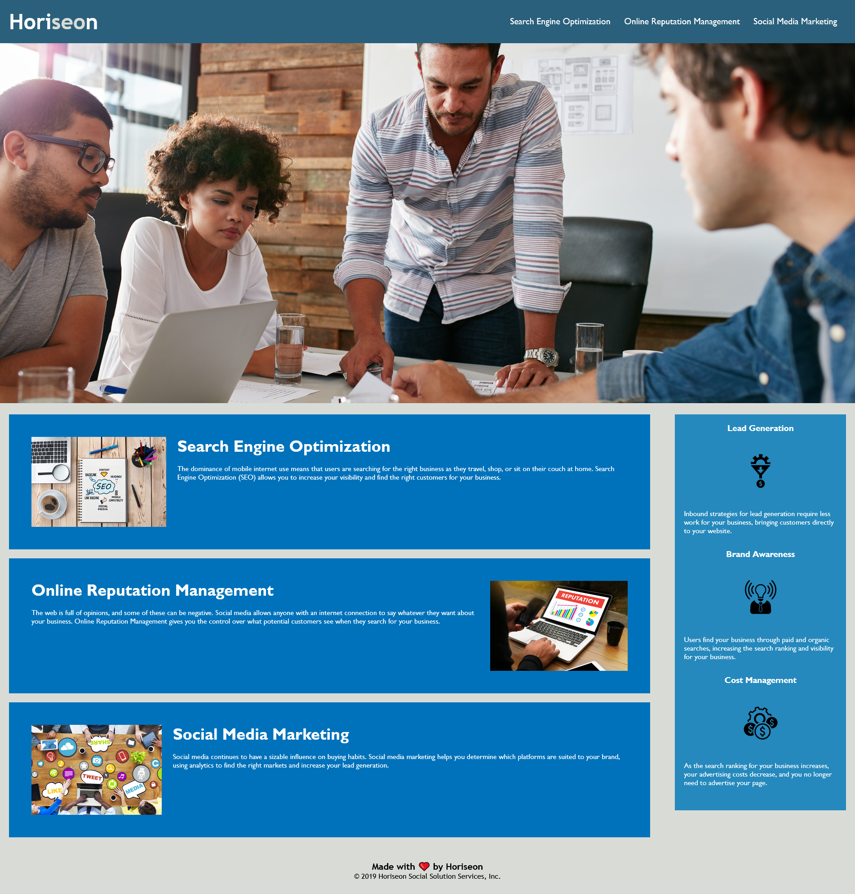

# Bootcamp Challenge One

## Description

This project is a refactoring of a Horiseon Marketing webpage in order to update it to proper accessibility standards. A non-exhaustive list of the changes made are as follows:

* Alt text has been added to the images.
* All HTML elements have been converted to their semantic variants.
* Dead link in the navigation bar fixed.
* Class tags have been consolidated, along with their corresponding CSS rulesets.
* Extensive CSS comments explaining functionality.
* CSS reorganized to follow a logical order matching the HTMl order.

This project was useful in teaching me about HTML and CSS best practices, as well as how to properly read and interpret project user stories and acceptance criteria. It also showed the importance of semantic HTML elements, and how to effectively read and parse pre-written code.

## Finished Webpage

The finished webpage can be found [here!](https://alecryanhunter.github.io/bootcamp-challenge-one)

## Screenshot

